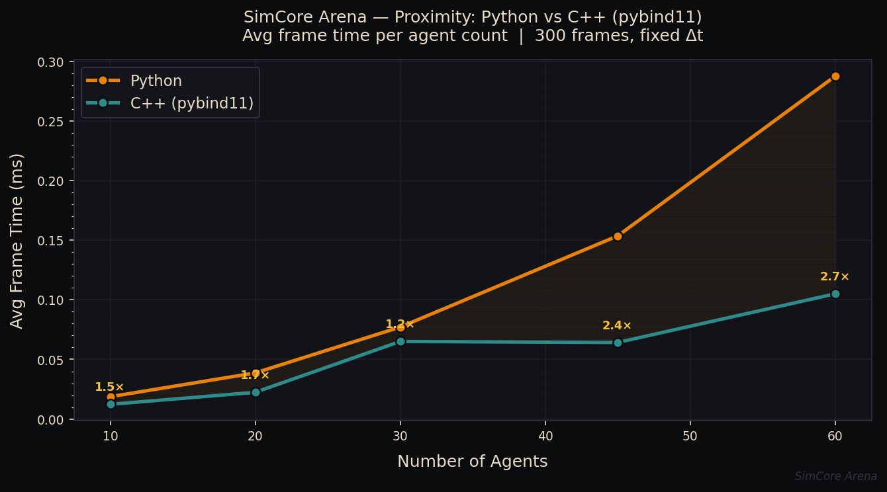

# SimCore Arena

A real-time 3D multi-agent AI simulation built with **Panda3D**, demonstrating
agent-based simulation, proximity-driven state machines, and measurable
performance engineering via a **C++ / pybind11** proximity module.

---

## Demo

> Launch with `python main.py --agents 60 --mode cpp` then click anywhere on the
> ground to relocate the seek target.

| State  | Colour | Behaviour |
|--------|--------|-----------|
| SEEK   | 🟢 Green | Moves toward the shared target |
| AVOID  | 🔴 Red   | Steers away from crowded neighbours |
| IDLE   | 🔵 Blue  | Wanders with a slowly drifting heading |

---

## Performance Benchmark

Headless simulation — 300 frames, fixed Δt = 1/60 s, reproducible random seed.

| Agents | Python avg (ms) | Python FPS | C++ avg (ms) | C++ FPS | Speedup |
|-------:|----------------:|-----------:|-------------:|--------:|--------:|
|     10 |           0.019 |    53 437  |        0.012 |  81 262 |  1.52 × |
|     20 |           0.039 |    25 873  |        0.022 |  44 639 |  1.73 × |
|     30 |           0.077 |    12 968  |        0.065 |  15 381 |  1.19 × |
|     45 |           0.154 |     6 511  |        0.064 |  15 573 |  2.39 × |
|     60 |           0.288 |     3 478  |        0.105 |   9 524 |  2.74 × |

> C++ wins consistently from 10 agents onward, reaching **2.74× speedup at 60 agents**. The shaded region on the chart shows the growing gap between back-ends as agent count scales.



The graph plots average frame time (ms) on the Y-axis against agent count on
the X-axis for both back-ends. Yellow annotations show the per-point speedup
ratio.

---

## Visual Design

SimCore Arena uses a unified **charcoal + amber / crimson / teal** palette
across the Panda3D scene, the GIF renderer, and the benchmark chart — no
default matplotlib or generic game-engine colours.

| Role | Hex | Usage |
|---|---|---|
| Canvas | `#0b0c0e` | Scene background, chart background |
| Panel | `#111318` | Plot area |
| Border / grid | `#2e3340` | Arena walls, chart spines, grid lines |
| **SEEK** | `#e8820c` | Amber-orange — agents moving toward target |
| **AVOID** | `#c0392b` | Deep crimson — agents steering away |
| **IDLE** | `#2e8b8b` | Slate teal — wandering agents |
| Target / gold | `#f0c040` | Seek-target marker, speedup annotations |
| Text | `#e8dcc8` | Warm off-white — HUD, chart labels |
| Dim text | `#6a7080` | Tick marks, watermarks |

---

## Architecture

```
simcore_arena/
├── main.py               # Panda3D ShowBase app — scene, HUD, task loop
├── benchmark.py          # Headless benchmark + matplotlib chart
├── setup.py              # pybind11 build script for the C++ module
│
├── agents/
│   └── agent.py          # Agent class — position, velocity, SEEK/AVOID/IDLE FSM
│
├── systems/
│   ├── proximity.py      # ProximitySystemPython / ProximitySystemCpp
│   └── simulation.py     # SimulationSystem — owns agents, drives update loop
│
├── cpp_module/
│   └── proximity.cpp     # C++ O(n²) neighbour scan exposed via pybind11
│
└── assets/               # (reserved for textures / models)
```

### Data flow (per frame)

```
TaskManager.update(dt)
        │
        ▼
SimulationSystem.update(dt)
        │
        ├─ ProximitySystem.get_neighbors(agents, radius)
        │       Python: pure O(n²) loop
        │       C++:   pybind11 → find_neighbors(xs, ys, radius)
        │
        └─ for each Agent:
               Agent.update(dt, neighbors)
                   _decide_state()   → SEEK | AVOID | IDLE
                   _apply_behavior() → update position
                   node_path.set_pos() → sync Panda3D scene graph
```

---

## C++ Integration

`cpp_module/proximity.cpp` implements `find_neighbors(xs, ys, radius)`:

- Receives flat `std::vector<double>` arrays — zero-copy from Python lists.
- Compares **squared distances** to avoid `sqrt` in the hot loop.
- Compiled with `-O3 -march=native -ffast-math`.
- Returns `std::vector<std::pair<int,int>>` — auto-converted by pybind11 STL
  bindings to a Python `list[tuple[int,int]]`.

The Python layer reconstructs the neighbour dict from the index pairs using a
pre-built `id → Agent` lookup table, keeping the C++ call signature simple and
the Python glue readable.

---

## Requirements

| Package     | Version |
|-------------|---------|
| panda3d     | ≥ 1.10  |
| pybind11    | ≥ 2.11  |
| matplotlib  | ≥ 3.7   |
| numpy       | ≥ 1.24  |
| A C++17 compiler (`g++` / `clang++`) | — |

Install:

```bash
pip install panda3d pybind11 matplotlib numpy
```

---

## Setup

### 0 — Install requirements

```bash
pip install -r requirements.txt
```

### 1 — Build the C++ module (one-time)

```bash
python setup.py build_ext --inplace
```

A `.so` file (`proximity_cpp.cpython-*.so`) is placed in the project root.

### 2 — Run the simulation

```bash
# Python proximity back-end (default)
python main.py

# C++ proximity back-end
python main.py --mode cpp

# Control agent count
python main.py --agents 60 --mode cpp
```

**Camera controls**

| Key / Input | Action |
|-------------|--------|
| Arrow keys / WASD | Pan camera |
| Mouse wheel | Zoom |
| Left click on ground | Move seek target |
| ESC | Quit |

### 3 — Run the benchmark

```bash
# Default: 10 20 30 45 60 agents, 300 frames each
python benchmark.py

# Custom
python benchmark.py --agents 10 30 60 100 --frames 500 --output my_bench.png

# Python only (no C++ module required)
python benchmark.py --no-cpp
```

Results are printed to stdout and a chart is saved to `benchmark.png`.

### 4 — Verify your setup

```bash
python verify.py
```

Runs 15 automated checks (imports, C++ correctness, FSM priority, determinism,
speedup) and reports PASS / FAIL for each. All 15 should pass on a correctly
configured environment.

### 5 — Generate the demo GIF (no display needed)


```bash
python generate_demo.py                         # 35 agents, 90 frames
python generate_demo.py --agents 50 --frames 120 --fps 20
```

Produces `demo.gif` using matplotlib's Agg backend — runs headlessly on any
server or CI environment.

---

## Design Decisions

- **No physics engine** — distance-based proximity keeps the dependency surface
  minimal and makes the C++ speedup clearly attributable.
- **Fixed Δt in benchmark** — eliminates timing noise so results are
  reproducible across machines.
- **Fallback path** — `ProximitySystemCpp` gracefully falls back to Python if
  the `.so` is missing, so the simulation always runs.
- **State priority** — AVOID > SEEK > IDLE ensures collision avoidance is never
  overridden by goal-seeking, producing visually convincing emergent behaviour.

---

## License

MIT — see `LICENSE`.
